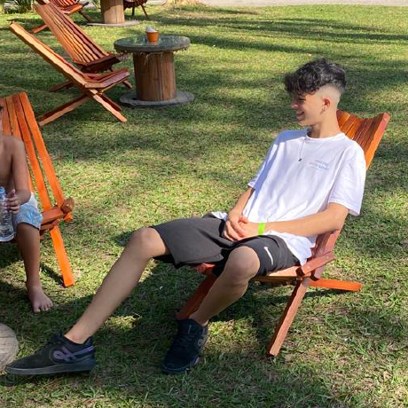

<h1 align="left">Hello, I'm Lucas 👋</h1>

###

  

###

  
  
  
  

###

###

  
  
  
  
  
  
  
  
  
  
  
  
  
  
  
  
  
  
  
  
  
  
  
  
  
  
  
  
  
  
  
  
  
  
  
  
  
  
  

###

  
  
  

###
